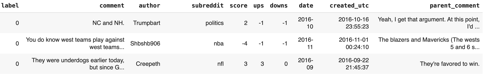
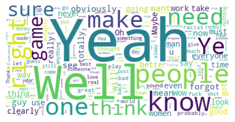
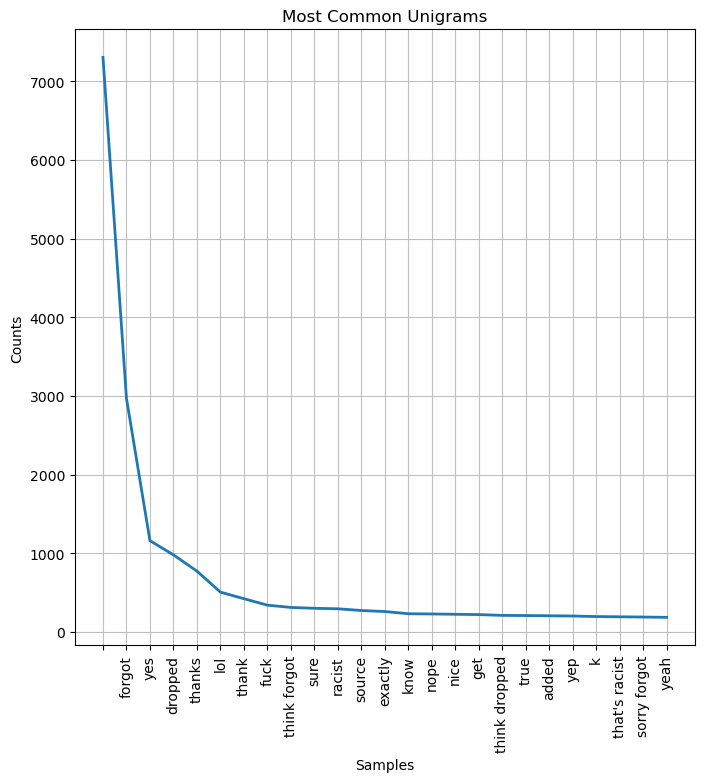
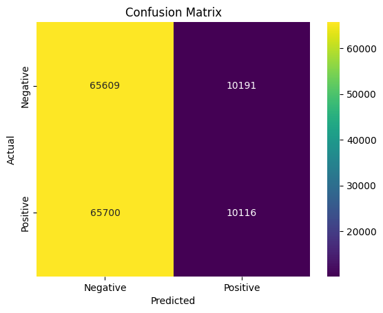

# Sarcasm Detection for Content Moderation
Author: Adam Pell

# Introduction
For my final project, I am building a series of models with the goal of detecting sarcasm in a collection of Reddit comments. To achieve this, I am leveraging multiple Natural Language Processing (NLP) techniques, including different types of tokenization, vectorization, and word embeddings.

The work all appears in this notebook, which includes instructions on data retrieval, preprocessing, and modeling, along with an option to import pre-trained model weights for quicker prediction results.

The processes required for this analysis can be broken down into x parts:

1. **Data Collection and Preparation**: Downloading the dataset and converting it into a format suitable for analysis.
2. **EDA**: Analyzing key metrics and getting a deeper understanding of the characteristics of our most important features.
3. **Preprocessing**: Tokenizing and cleaning the raw text before converting the vocabulary into numerical representations (vectors).
4. **Modeling**: Iteratively fitting different machine learning algorithms to our vectorized data and mapping the results.
5. **Evaluation and Conclusion**: Discussing the performance of our models and forming recommendations baed on results.

**Image: First 5 Rows of Dataset**

# Objectives
The objectives of this project are:
1. To see whether there are differences in the vocabulary of sarcastic responses vs. serious ones.
2. To extract features from the raw text that capture some degree of context.
3. Model the extracted features and assess how results could be improved.

# Business Case
Sarcasm presents a unique linguistic challenge. Heavily reliant on context and inherently ambiguous, sarcasm is used in different ways across many cultures. Despite its everyday use in conversation, it can be difficult to detect in text. This is because we often need to see and hear someone say something to understand whether they are serious or not. We subconsciously notice tiny changes in tone, facial expression, and even body language to make our decision. When reading, we don't have that luxury. Without underlying contextual and tonal clues, a message that is meant to be sarcastic often does not vary widely from a sentence where the meaning is meant to be taken literally.

Being able to effectively detect sarcasm has, until very recently, been a distinctly human endeavor. This project aims to take a step forward in changing that. **With the use of various NLP techniques, we can attempt to capture some underlying context from Reddit comments that display sarcasm and learn to predict it better.**

With the understanding that sarcasm detection can be extremely difficult for computers, **I would propose the deployment of our final model for content moderation and bullying detection on Reddit in concert with humans.** Given that much content moderation is still manual, even an imperfect model could lessen the load for human moderators by tagging messages as sarcastic. Given that many sarcastic messages can be intentionally humorous but would be offensive or concerning if taken seriously, this is a valuable service to provide at scale.

**Reddit could leverage this technology in many ways. Specifically, they could use it to enforce punishments for inappropriate language, detect bullying, or better recommend certain content to people who tend to interact with or publish more sarcastic content. This could improve the user experience on the app and increase general satisfaction, as well as making Reddit a safer place for everyone.**

Given that sarcasm is often also humorous, automated moderation and detection has a wide range of applications and could someday be used across multiple social platforms. This project can serve as a pilot with a relatively small sample size to see if sarcasm detection with different models is feasible at a larger scale.

# Data Understanding
Our data is sourced from this [Kaggle dataset](https://www.kaggle.com/datasets/sherinclaudia/sarcastic-comments-on-reddit/data). According to the user who publised it, the dataset was created by scraping comments from Reddit, many of which included the '/s' tag, a tag commonly used to denote sarcasm. The owner of the dataset notes that "This tag is often used by Redditors to indicate that their comment is in jest and not meant to be taken seriously, and is generally a reliable indicator of sarcastic comment content."

The data consists of 1.3 million rows of Reddit comments, manually assigned labels of 1 or 0 (sarcastic or not sarcastic). The dataset also includes more information on each comment, including the subreddit it was posted on, the number of upvotes or downvotes, and the "parent comment"-- the post that the labeled comment was responding to.

The creators also offered a balanced version of the dataset, which has an equal number of sarcastic and non-sarcastic comments but features about 300,000 fewer rows. I opted for this version because it saves some resampling steps during preprocessing. For the purposes of this project, many of the additional columns were discarded and we primarily focus on the primary comments.

For this analysis, the target metrics are:
- **Recall:** For our purposes, we of course want to maximize the instances of sarcasm (or non-sarcasm) that our models can detect. Ideally, we want recall for both negative and positive cases to be high, but the more important of the two would be recall for the **positive case**, meaning that we capture a high number of sarcastic comments.
- **Accuracy:** This is a much more general statistic for model performance, so it acts as a good becnhmark for overall quality as we iterate.

**Image: Wordcloud for non-sarcastic comments**

**Image: Wordcloud for sarcastic comments**

## Limitations
For our dataset, one specific limitation sticks out:

- **Inconsistent labeling.** This especially applies to the non-sarcastic or "negative" category. While the sarcastic comments were specifically tagged (making them more accurate), manual inspection of some of the data has yielded many comments labeled non-sarcastic that, in my opinion, should be labeled as sarcastic. This kind of labeling is highly subjective, and, because the labels are vital to model training, inconsistency can throw off its ability to predict accurately.

Beyond that, datasets scraped from social media can have several limitations preparation and modeling in general:

- **They can be "messy".** Not just in terms of punctuation and grammar (which can be cleaned away), but there also is a myriad of slang, profanity, abbreviations, and words that are extremely specific to a certain context-- the name of a video game character or ability, for example. When we are looking to understand patterns and context, these can serve as limiting factors.
- **They can be too short.** The Reddit comments we are dealing with are often responses to another comment, and therefore are often fairly short, many with only a handful of words and some with just one or two. When we are looking for sarcasm, this can be challenging for a model to understand.

# Methods
My modeling process features a wide range of methods, including Multinomial Naive Bayes, XGBoost, and two types of neural networks (multilayer perceptrons and long short-term memory). Preprocessing steps include tokenization, cleaning, lemmatization, and vectorization using both TF-IDF and Word2Vec.

**Image: Most Common 25 Unigrams**

# Results
Our most performant model turned out to be our MLP neural network. With recall and accuracy of 66%, this model should be best for general-purpose implementation.

**Image: Confusion Matrix for Neural Network**

The table below shows a table of how our models performed as we iterated through the analysis:

| Model Type     | Recall (Class 0) | Recall (Class 1) | Accuracy | Time To Run |
|----------------|------------------|------------------|----------|-------------|
| Naive Bayes    | 74%              | 55%              | 64%      | >1s         |
| XGBoost        | 94%              | 21%              | 58%      | 5min.       |
| MLP Neural Net | 75%              | 57%              | 66%      | 21min.      |
| RNN Neural Net | 91%              | 16%              | 54%      | 31min.      |

As we can see, each model has its own quirks and we don't see a steady improvement across models. The most notable phenomenon is the large jumps in class 0 recall for the XGBoost and RNN models. This could open up different implementation strategies down the line. For our purposes, however, I think it is appropriate to use a more balanced model if it more performant overall. This way, it can consistently assist human moderators to a consistent, known degree.

Depending on the number of epochs or complexity, further training could take an extremely long time if we hope to see even marginal improvements in performance.

# Conclusions
While our models did not give us excellent performance on our target metrics, this project has provided us valuable information on the complexities on sarcasm detection, shown us effective and ineffective techniques, and demonstrated the limitations of our dataset.

Our neural network is the most performant and most consistent model in its evaluations. That makes it most viable for implementation.

Even without outstanding recall and accuracy, **I believe that the MLP neural network could be used in a hybrid system, in tandem with existing teams of human moderators.**

More specifically, I recommend that this hybrid approach be leveraged by Reddit for the following tasks:

- **Detecting bullying messages and gathering data on bad actors, leading to bans or suspensions**
- **Detect disturbing content, such as threats, and assess their veracity**
- **Recommend certain content for people who interact with or post sarcastic content**

In a multi-tiered system, a less-accurate model that processes quickly could serve as a filter that catches and flags certain content before travels up the chain to either an improved model or a team of humans. In this way, moderators are saved some time and can focus on more complex problems or moderate more content per day, as this model allows them to cast a wide net and whittle down content as they go. This strategy could also work for flagging a wide range of comments and leaving humans to make the final decision.

Even if these strategies are not implemented, we have provided a baseline and proof-of-concept for sarcasm detection over a diverse and difficult range of texts. Further investment in Research and Development, allowing for longer, more complex, and more costly training methods, could yield significant performance gains, especially with a larger dataset that is labeled carefully.

Below I have included some recommendations of next steps that could yield better performance or make implementation more realistic:

## Next Steps
- **Data quality and quantity:** As mentioned in the 'Limitations' section, I believe that some models would show improvement if the data was better labeled and if there was more of it. For use in a real-life setting, I suspect the model would need a much larger vocabulary to be able to keep up with the diversity of speech on a platform like Reddit.
- **Hyperparameter tuning and further optimization:** Some methods could be used to exhaustively search over model hyperparameters to find optimal ones. Given the speed of XGBoost and Naive Bayes, these options could be implemented in the future.
- **Fine-tuning foundational model:** Below my contact information, I have provided some code for initializing and implementing BERT, an extremely large and complex language model deployed by HuggingFace. Fine-tuning this model on our data could yield exceedingly good results, but would take hours or days to train.
## Contact Information
- Email: apell7591@gmail.com
- Phone: 917-434-6615
- GitHub: [apell7594](https://github.com/apell74)
- LinkedIn: [Adam Pell](www.linkedin.com/in/adam-pell-911868154)

## Repository Structure
